# 📖 Manual Penggunaan Dashboard BSPS Jawa Timur 2026

**URL:** [https://bsps-jatim2026.my.id](https://bsps-jatim2026.my.id)

Dashboard ini menampilkan sebaran data **Bantuan Stimulan Perumahan Swadaya (BSPS)** Tahap I Tahun 2026 untuk wilayah **Jawa Timur**, yang dikelola oleh **BP3KP Jawa IV, Surabaya**.

---

## 🏠 1. Halaman Utama (`index.html`)

Halaman utama menampilkan ringkasan keseluruhan data BSPS dalam **3 kategori**:

| Kategori | Ikon | Warna | Deskripsi |
|---|---|---|---|
| **Perdesaan** | 🏘️ | Hijau | Data desa penerima BSPS |
| **Perkotaan** | 🏙️ | Ungu | Data kelurahan penerima BSPS |
| **Pesisir** | 🌊 | Biru | Data desa pesisir penerima BSPS |

### Fitur Halaman Utama

- **Kartu Ringkasan** — Setiap kategori menampilkan:
  - Jumlah **Unit** alokasi
  - Jumlah **Desa/Kelurahan** penerima
  - Jumlah **Kabupaten/Kota** yang tercakup
  - **Breakdown per kabupaten** (daftar scrollable)
- **Selector Periode** — Dropdown untuk memilih Tahap I / II / III *(saat ini hanya Tahap I yang tersedia)*
- **Tombol Ganti Tema** 🌙/☀️ — Klik untuk beralih antara **Dark Mode** dan **Light Mode** *(tersimpan otomatis di browser)*
- **Tombol Cetak** 🖨️ — Membuka halaman laporan cetak

> [!TIP]
> Klik pada kartu kategori (Perdesaan/Perkotaan/Pesisir) untuk masuk ke **dashboard detail** dengan peta interaktif.

---

## 🗺️ 2. Dashboard Detail (Perdesaan / Perkotaan / Pesisir)

Ketiga dashboard detail memiliki layout dan fitur yang sama, disesuaikan dengan data masing-masing kategori.

### Layout

| Bagian | Posisi | Deskripsi |
|---|---|---|
| **Peta Interaktif** | Kiri (lebar) | Peta Leaflet/OpenStreetMap dengan marker lokasi |
| **Sidebar** | Kanan | Statistik, filter, dan tabel data |

### 2.1 Peta Interaktif

- **Circle Markers** — Setiap desa/kelurahan ditampilkan sebagai lingkaran pada peta. Ukuran lingkaran proporsional dengan jumlah unit alokasi
- **Warna Marker** — Berbeda berdasarkan kabupaten/kota untuk memudahkan identifikasi
- **Zoom & Pan** — Gunakan scroll mouse untuk zoom, dan klik-tahan untuk menggeser peta
- **Popup Informasi** — Klik pada marker untuk menampilkan:
  - Nama Desa/Kelurahan
  - Kecamatan dan Kabupaten
  - Jumlah Unit
  - Tombol **📍 OpenMap** — membuka lokasi di Google Maps (tab baru)

### 2.2 Stat Cards (Kartu Statistik)

Dua kartu di bagian atas sidebar:

| Kartu | Deskripsi |
|---|---|
| **Total Alokasi** | Jumlah total unit BSPS |
| **Total Desa/Kelurahan** | Jumlah lokasi penerima |

> [!IMPORTANT]
> Stat cards bersifat **dinamis** — ketika memilih kabupaten tertentu dari dropdown, angka akan langsung terupdate sesuai data yang difilter. Memilih "Semua" mengembalikan ke total keseluruhan.

### 2.3 Filter Kabupaten/Kota (Dropdown)

- Pilih **kabupaten/kota** dari dropdown untuk memfilter data
- Peta akan otomatis **fly/zoom** ke wilayah kabupaten yang dipilih
- Tabel di bawah hanya menampilkan data yang sesuai filter
- Stat cards langsung terupdate

### 2.4 Pencarian (Search)

- Ketik nama **desa, kecamatan, atau kabupaten** di kolom pencarian
- Filter berlaku secara **real-time** (tanpa klik Enter)
- Dapat dikombinasikan dengan filter dropdown kabupaten

### 2.5 Tabel Data

| Kolom | Deskripsi |
|---|---|
| **Desa/Lokasi** | Nama desa + kabupaten |
| **Kecamatan** | Nama kecamatan |
| **Unit** | Jumlah unit alokasi (badge) |

- **Klik baris tabel** → peta akan fly ke lokasi tersebut dan membuka popup informasi marker

### Perbedaan antar Dashboard

| Dashboard | File | Data Source | Warna Tema |
|---|---|---|---|
| Perdesaan | `dashboard_perdesaan.html` | `data_desa.json` | Hijau |
| Perkotaan | `dashboard_perkotaan.html` | `data_kota.json` | Ungu |
| Pesisir | `dashboard_pesisir.html` | `data_pesisir.json` | Biru |

---

## 🖨️ 3. Halaman Cetak Laporan (`cetak.html`)

Halaman ini menghasilkan **laporan format A4** yang siap dicetak/di-PDF-kan.

### Isi Laporan

1. **Header** — Judul dan badge Tahap I
2. **Ringkasan Total** — Total unit, total desa/kelurahan, total kabupaten/kota
3. **Peta Sebaran** — Peta statis dengan label kabupaten berwarna:
   - Hijau = Perdesaan
   - Ungu = Perkotaan
   - Biru = Pesisir
4. **Breakdown per Kategori** — 3 kotak (Perdesaan, Perkotaan, Pesisir) dengan rincian per kabupaten
5. **Grafik Distribusi** — Bar chart horizontal alokasi per kabupaten
6. **Footer** — Logo dan info Kementerian PKP + BP3KP Jawa IV

### Cara Mencetak

1. Buka halaman cetak (klik 🖨️ dari halaman utama)
2. Klik tombol **🖨️ Cetak PDF** di pojok kanan bawah
3. Pilih **"Save as PDF"** sebagai printer
4. Pastikan ukuran kertas **A4 Portrait**

---

## 🔧 4. Navigasi Antar Halaman

```mermaid
graph TD
    A["🏠 Halaman Utama<br/>index.html"] --> B["🏘️ Dashboard Perdesaan<br/>dashboard_perdesaan.html"]
    A --> C["🏙️ Dashboard Perkotaan<br/>dashboard_perkotaan.html"]
    A --> D["🌊 Dashboard Pesisir<br/>dashboard_pesisir.html"]
    A --> E["🖨️ Cetak Laporan<br/>cetak.html"]
    B --> A
    C --> A
    D --> A
```

- Dari halaman utama → klik kartu kategori untuk masuk dashboard detail
- Dari dashboard detail → klik **← Kembali** di header untuk kembali ke halaman utama
- Dari halaman utama → klik 🖨️ untuk ke halaman cetak

---

## 📱 5. Responsivitas

Dashboard ini mendukung tampilan di berbagai perangkat:

| Perangkat | Tampilan |
|---|---|
| **Desktop** | Peta dan sidebar berdampingan |
| **Tablet** | Peta di atas, sidebar di bawah |
| **Mobile** | Layout vertikal penuh, elemen disesuaikan ukurannya |

---

## 📂 6. Struktur Data

Data tersimpan dalam 3 file JSON terpisah:

| File | Kategori | Fields |
|---|---|---|
| `data_desa.json` | Perdesaan | `k` (kode), `d` (desa), `kc` (kecamatan), `kb` (kabupaten), `j` (jumlah unit), `lat`, `lng` |
| `data_kota.json` | Perkotaan | Sama seperti di atas |
| `data_pesisir.json` | Pesisir | Sama seperti di atas |

---

## ❓ FAQ

**Q: Kenapa beberapa marker tidak muncul di peta?**
> Koordinat GPS mungkin belum akurat. Hubungi admin untuk koreksi.

**Q: Apakah data bisa di-update?**
> Ya, edit file JSON yang sesuai dan push ke GitHub. Perubahan akan langsung terlihat di website.

**Q: Bagaimana cara menambah data Tahap II?**
> Buat file JSON baru dan update logika `changeTahap()` di `index.html`.
